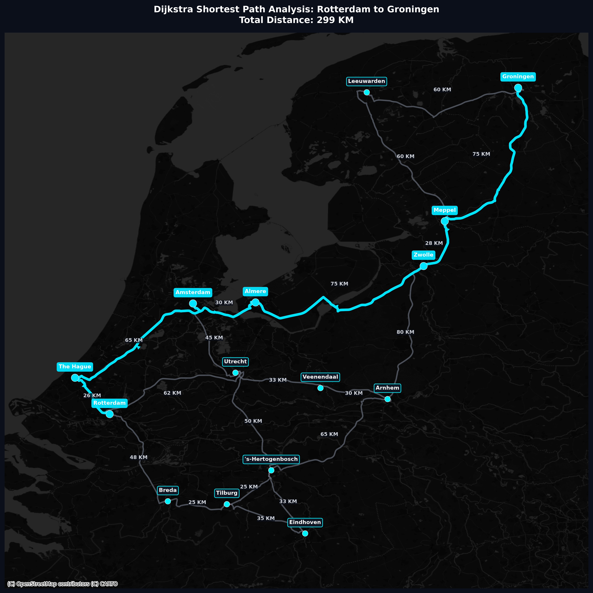

# Netherlands Infrastructure Network Model

A Python-based simulation and visualization tool for the Dutch highway network. This project models major cities in the Netherlands as nodes in a graph and calculates optimal routes using real-world road geometries and a custom implementation of Dijkstra's algorithm.

## Dijkstra's Algorithm Implementation

The core of this project is a manual implementation of Dijkstra's shortest path algorithm, located in `slover.py`. While libraries like `networkx` offer built-in solvers, this project implements the algorithm from scratch to demonstrate the underlying mechanics of pathfinding in a weighted graph.

### How it Works

1.  **Initialization**: 
    - Every node is assigned a distance value: 0 for the starting city (e.g., Rotterdam) and infinity for all others.
    - All nodes are marked as unvisited.
2.  **Greedy Selection**: 
    - The algorithm repeatedly selects the unvisited node with the smallest current distance.
3.  **Edge Relaxation**: 
    - For the selected node, it examines all neighbors and calculates their distance from the start through the current node. 
    - If this new path is shorter than the previously known distance, the distance is updated, and the current node is recorded as the "previous" node for the neighbor.
4.  **Path Reconstruction**: 
    - Once the destination (e.g., Groningen) is reached or all nodes are visited, the algorithm backtracks from the destination using the "previous" records to construct the optimal route.

### Key Features of the Solver

- **Weighted Graph**: Each edge between cities is weighted by the actual highway distance in kilometers.
- **Path Visualization**: The calculated path is highlighted on a high-resolution map, overlaid with real-world road geometries.
- **Distance Calculation**: Provides the exact total distance of the shortest route.

## Features

- **Graph-based Infrastructure**: Uses `networkx` to model cities and highway connections.
- **Real Road Geometries**: Fetches actual street-level tracking points from the OSRM API for high-fidelity mapping.
- **Shortest Path Analysis**: Custom Dijkstra implementation to find the most efficient route between cities.
- **Advanced Visualization**: Generates maps with `matplotlib` and `contextily`, overlaying network data on dark-themed basemaps.

## Project Structure

- `infrastructure.py`: Defines the network, fetches live routing data, and exports the initial infrastructure map.
- `slover.py`: Contains the Dijkstra engine and visualizes the shortest path between nodes.
- `highway_geometries.json`: Cached GeoJSON data containing the physical curves of the highways.
- `netherlands_infrastructure.graphml`: The exported graph structure.

## Requirements

```bash
pip install networkx matplotlib contextily
```

## Usage

### 1. Build the Network
```bash
python infrastructure.py
```
Generates the graph and caches road geometries.

### 2. Solve for Shortest Path
```bash
python slover.py
```
Calculates the optimal route and outputs `shortest_path.png`.

## Visualizations

### Dijkstra Shortest Path Analysis

*The cyan line indicates the shortest path calculated by the Dijkstra algorithm from Rotterdam to Groningen.*
