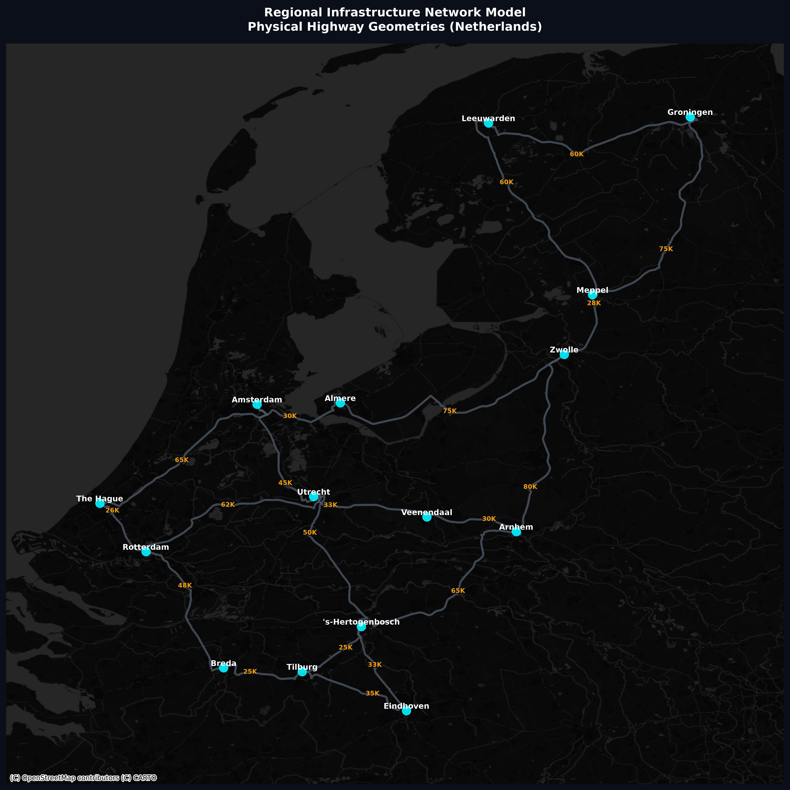

# Netherlands Infrastructure Network Model

A Python-based simulation and visualization tool for the Dutch highway network. This project models major cities in the Netherlands as nodes in a graph and calculates optimal routes using real-world road geometries and Dijkstra's algorithm.

## Features

- **Graph-based Infrastructure**: Uses `networkx` to model cities and highway connections.
- **Real Road Geometries**: Fetches actual street-level tracking points from the OSRM API for high-fidelity mapping.
- **Shortest Path Analysis**: Implements a manual Dijkstra algorithm to find the most efficient route between cities.
- **Advanced Visualization**: Generates high-resolution maps with `matplotlib` and `contextily`, overlaying network data on dark-themed basemaps.

## Project Structure

- `infrastructure.py`: The build script that defines the network, fetches live routing data, and exports the initial infrastructure map.
- `slover.py`: The pathfinding engine that loads the network and visualizes the shortest path between two points (e.g., Rotterdam to Groningen).
- `highway_geometries.json`: Cached GeoJSON-like data containing the physical curves of the highways.
- `netherlands_infrastructure.graphml`: The exported graph structure.

## Requirements

Ensure you have the following Python libraries installed:

```bash
pip install networkx matplotlib contextily
```

## Usage

### 1. Build the Network
Run the infrastructure script to initialize the graph and download highway geometries:
```bash
python infrastructure.py
```
This generates `netherlands_infrastructure.graphml`, `highway_geometries.json`, and `map_infrastructure.png`.

### 2. Solve for Shortest Path
Calculate and visualize the optimal route between specific cities:
```bash
python slover.py
```
This will output `shortest_path.png` showing the calculated route.

## Visualizations

### Infrastructure Map


### Shortest Path Analysis


## License
MIT
